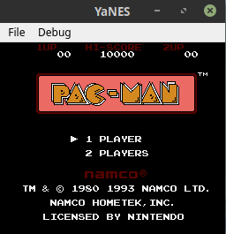
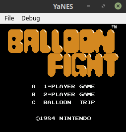

# YaNES
A Semi Cycle Accurate NES Emulator &nbsp;&nbsp;&nbsp;&nbsp; 
[](https://travis-ci.org/Grandduchy/YaNES) &nbsp;
[](https://github.com/Grandduchy/YaNES/issues) &nbsp;
[](https://github.com/Grandduchy/YaNES/blob/master/LICENSE) &nbsp;
[](https://github.com/Grandduchy/YaNES/stargazers) &nbsp;

<p align = "center">
  
  
  
</p>

## Getting Started
These instructions will get you a copy of the project up and running on your local machine for development and testing purposes. 

### Prerequisites

QT is needed to run YaNES <br />
Boost libraries are only required to run the tests. <br />
The microprocessor and picture proccessing unit by itself does not require any external libraries, however <br />
YaNES does require a C++14 compiler

#### Installing Prerequisites - QT
Qt can either be installed through Qt's website installer located <a href="https://www.qt.io/download-qt-installer">here</a> or by installing by the command line. <br>
Installing through command line:
```
sudo apt install qtbase5-dev qtdeclarative5-dev
sudo apt install qt5-default qttools5-dev-tools
sudo apt install qtmultimedia5-dev
```
Depending on the installation, Qmake will need to be configured this is done by:
```
export QMAKE=/usr/lib/x86_64-linux-gnu/qt5/bin/qmake
```

#### Installing Prerequisites - Boost Libraries
YaNES makes use of Boost.Test and Boost.Program_Options
```
sudo apt install libboost-dev
sudo apt install libboost-program-options-dev
```

### Installing - Getting a development environment running
Either download and unzip this repository via the top right or by cloning the repository first:
```
git clone https://github.com/Grandduchy/YaNES
cd YaNES
```
Use Qmake and Make to create the executable
```
qmake
make
```
Depending on the configuration, add executable permissions to the executable app, and run
```
chmod +x app
./app
```

## Running the tests
Refer to YaNES/test/README.md

## Built With

* [QT](https://doc.qt.io/) - The GUI framework
* [Boost](https://www.boost.org/) - C++ Libraries
  * [Boost.Test](https://www.boost.org/doc/libs/1_71_0/libs/test/doc/html/index.html)
  * [Boost.Program_options](https://www.boost.org/doc/libs/1_71_0/doc/html/program_options.html)
* [Travis-CI](https://travis-ci.org/) - Continuous Integration Framework

## Authors

* **Joshua Challenger** - *Complete Project* - [Grandduchy](https://github.com/Grandduchy)

## License

This project is licensed under the MIT License - see the [LICENSE](LICENSE) file for details

## Acknowledgments and Sources
A ton of sources were used to create this project <br />
Below are the main ones used.
- https://wiki.nesdev.com/ *
- http://nesdev.com/NESDoc.pdf
- http://6502.org/tutorials/6502opcodes.html
- https://www.pagetable.com/?p=410
- http://www.dustmop.io/blog/2015/04/28/nes-graphics-part-1/
- https://github.com/fogleman/nes
- https://wiki.nesdev.com/w/index.php/Emulator_tests
